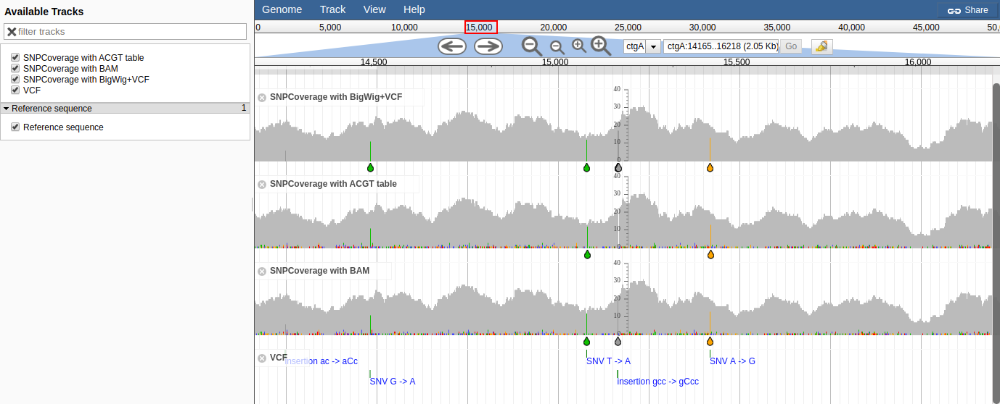

# mpilupplugin

## Screenshot



## Example setup


    samtools mpileup -f volvox.fa -q 20 volvox-sorted.bam  |  sequenza-utils pileup2acgt -p - > out.txt
    # now comment out the header line, don't have the sed 1 liner for this
    bgzip out.txt
    # start and end are same column
    tabix  -s 1 -b 2 -e 2 out.txt.gz -f


Currently assumes data format like this

```
#chr    n_base  ref_base        read.depth      A       C       G       T       strand
ctgA    3       T       1       0       0       0       1       0:0:0:1
ctgA    4       T       1       0       0       0       1       0:0:0:1
ctgA    5       G       1       0       0       1       0       0:0:1:0
ctgA    6       T       1       0       0       0       1       0:0:0:1
ctgA    7       T       1       0       0       0       1       0:0:0:1
ctgA    8       G       2       0       0       2       0       0:0:2:0
ctgA    9       C       2       0       2       0       0       0:2:0:0
ctgA    10      G       2       0       0       2       0       0:0:2:0
ctgA    11      G       2       0       0       2       0       0:0:2:0
ctgA    12      A       2       2       0       0       0       2:0:0:0
ctgA    13      G       2       0       0       2       0       0:0:2:0
ctgA    14      T       2       0       0       0       2       0:0:0:2
ctgA    15      T       2       0       0       0       2       0:0:0:2
ctgA    16      G       3       0       0       3       0       0:0:3:0
ctgA    17      A       4       4       0       0       0       4:0:0:0
ctgA    18      A       5       4       0       1       0       4:0:1:0
ctgA    19      C       5       0       5       0       0       0:5:0:0
ctgA    20      A       5       5       0       0       0       5:0:0:0
ctgA    21      A       5       5       0       0       0       5:0:0:0

```

## Sample config

The configuration looks like this, where type is our custom SNPCoverage track type (to avoid some constructor behavior of the default SNPCoverage that assumes BAM input)

The storeClass is also our custom store class

    {
      "type": "MPileupPlugin/View/Track/SNPCoverage",
      "storeClass": "MPileupPlugin/Store/SeqFeature/ACGT",
      "label": "SNPCoverage with ACGT table",
      "urlTemplate": "out.bed.gz"
    }

See also test/data/trackList.json

In tracks.conf format this is


    [tracks.snpcov]
    type=MPileupPlugin/View/Track/SNPCoverage
    storeClass=MPileupPlugin/Store/SeqFeature/ACGT
    key=SNPCoverage with ACGT table
    urlTemplate=out.bed.gz

## Intallation

Clone the repository to the jbrowse plugins subdirectory and name it MPileupPlugin

    git clone https://github.com/cmdcolin/mpilupplugin MPileupPlugin

Then add the plugin to your configuration, e.g. "plugins": ["MPileupPlugin"]

See http://gmod.org/wiki/JBrowse_FAQ#How_do_I_install_a_plugin for details
